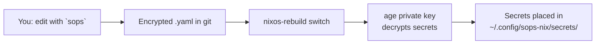

# sops-nix — Secrets Management

This project uses [sops-nix](https://github.com/Mic92/sops-nix) for managing secrets (API keys, tokens, passwords). Secrets are **encrypted at rest** in the repo and **decrypted at build time** on each host.

## How It Works



1. **Encryption**: The `sops` CLI encrypts YAML values using your **age public key** (configured in `.sops.yaml`).
2. **Storage**: The encrypted file (`secrets/secrets.yaml`) is safe to commit — only the key holder can read it.
3. **Decryption**: At build time, sops-nix uses your **age private key** (`~/.config/sops/age/keys.txt`) to decrypt.
4. **Runtime**: Each YAML key becomes a separate file — `deepseek_api_key` → `~/.config/sops-nix/secrets/deepseek_api_key`.

## Architecture (Dendritic Pattern)

```
flake.nix
  └── inputs.sops-nix
        │
        ├── modules/features/sops.nix
        │     └── flake.nixosModules.sops          ← system-level secrets (future use)
        │
        └── home/system/sops.nix
              └── flake.homeModules.sops            ← user-level secrets (API keys)
                    └── OPT-IN: imported per-host in home-manager.nix

.sops.yaml                                          ← tells `sops` which keys to encrypt for
secrets/secrets.yaml                                ← encrypted secrets (committed to git)
```

- **`modules/features/sops.nix`**: Dendritic flake-parts module — exposes `nixosModules.sops` for hosts that need system-level secrets (service passwords, etc.). Not currently used by any host.
- **`home/system/sops.nix`**: Home Manager module — imports `sops-nix.homeManagerModules.sops`, configures the age key path and secrets file. This module is **opt-in** — NOT in `defaultHomeManager`.
- **`.sops.yaml`**: SOPS configuration — which age public keys can encrypt secrets.
- **`secrets/secrets.yaml`**: The encrypted secrets file — each top-level YAML key is a named secret.

## Daily Commands

| Action | Command |
|--------|---------|
| **Edit secrets** | `sops secrets/secrets.yaml` |
| **View decrypted** | `sops -d secrets/secrets.yaml` |
| **Add new host key** | Edit `.sops.yaml`, then `sops updatekeys secrets/secrets.yaml` |
| **Rebuild** | `task mainpc:switch` (or `t580:switch`) |

## Adding a New Secret

```bash
# 1. Open the encrypted file
sops secrets/secrets.yaml

# 2. Add a new key
#    my_api_key: sk-abc123...

# 3. Save & exit — sops re-encrypts automatically

# 4. Declare it in your host's home-manager.nix:
#    sops.secrets.my_api_key = {};
```

After rebuild, access it from any Home Manager module:
```nix
config.sops.secrets.my_api_key.path
# → /home/ab_dullah/.config/sops-nix/secrets/my_api_key
```

## Opt-In Per Host

sops is NOT enabled for all hosts automatically. Each host opts in by importing `self.homeModules.sops` in its `home-manager.nix`:

```nix
# modules/hosts/<host>/home-manager.nix
{self, inputs, ...}: let
  inherit (self.homeModules) sops;
in {
  flake.nixosModules.<host>HomeManager = {pkgs, username, ...}: {
    home-manager.users.${username} = {
      imports = [ sops ];
      sops.secrets = {
        "my_secret" = {};
      };
    };
  };
}
```

## Extending to a New Host

1. **Get the host's SSH host key as an age key**:
   ```bash
   nix-shell -p ssh-to-age --run 'ssh-keyscan <host-ip> | ssh-to-age'
   ```

2. **Add it to `.sops.yaml`**:
   ```yaml
   keys:
     - &ab_dullah age1rgur94z2alzh...
     - &new_host  age1abc123...           # ← add this

   creation_rules:
     - path_regex: secrets/[^/]+\.yaml$
       key_groups:
       - age:
         - *ab_dullah
         - *new_host                      # ← add this
   ```

3. **Re-encrypt existing secrets for the new host**:
   ```bash
   sops updatekeys secrets/secrets.yaml
   ```

4. **Ensure the host has its age private key** — derive from SSH host key:
   ```bash
   nix-shell -p ssh-to-age --run \
     "ssh-to-age -private-key -i /etc/ssh/ssh_host_ed25519_key > ~/.config/sops/age/keys.txt"
   ```

5. **Import the sops module** in the host's `home-manager.nix` (see above).

## Key Management

### Your age key (already set up)

- **Private key**: `~/.config/sops/age/keys.txt`
- **Public key**: `age1rgur94z2alzh75nmw6sa2twmcuc7hgz3wc3ksnnflz3w7qdmypasmvhpjk`

The private key was derived from your SSH Ed25519 key:
```bash
nix-shell -p ssh-to-age --run \
  "ssh-to-age -private-key -i ~/.ssh/id_ed25519 > ~/.config/sops/age/keys.txt"
```

### Rotating your key

1. Generate a new age key: `age-keygen -o ~/.config/sops/age/keys.txt`
2. Get the new public key: `age-keygen -y ~/.config/sops/age/keys.txt`
3. Update `.sops.yaml` with the new public key
4. Re-encrypt all secrets: `sops updatekeys secrets/secrets.yaml`

## File Permissions

By default, decrypted secrets are `0400` (owner-read only). To change:

```nix
sops.secrets.my_secret = {
  mode = "0600";  # octal, same as chmod
  # owner = "username";       # default: current user
  # group = "groupname";      # default: current user's group
};
```

## Troubleshooting

### `sops` command not found
```bash
nix-shell -p sops
```

### Secret not decrypting at build time
- Check your age key exists: `ls -la ~/.config/sops/age/keys.txt`
- Verify it's the right key: `nix-shell -p age --run "age-keygen -y ~/.config/sops/age/keys.txt"`
- Confirm the public key matches `.sops.yaml`

### "Path is not tracked by Git"
New files must be `git add`ed before Nix flakes can see them:
```bash
git add .sops.yaml secrets/ home/system/sops.nix modules/features/sops.nix
```

### Adding secrets for a host that doesn't need sops
Don't — the sops module is opt-in. Hosts without `self.homeModules.sops` in their imports won't have the sops HM module, so the `secrets/secrets.yaml` path is never evaluated for them.

## References

- [sops-nix README](https://github.com/Mic92/sops-nix)
- [SOPS documentation](https://github.com/getsops/sops)
- [age encryption](https://github.com/FiloSottile/age)
